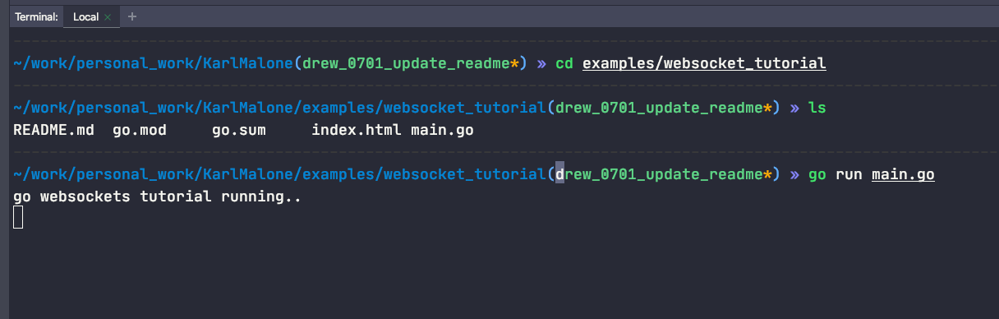
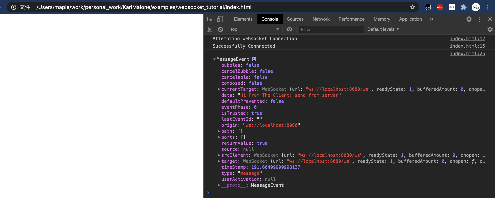
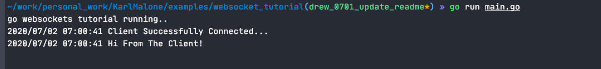

#websocket tutorial

[package websocket](https://godoc.org/github.com/gorilla/websocket)

## 介绍
1. 服务端的逻辑在main.go中，各个步骤详见代码注释。

2. 客户端的逻辑在index.html中(使用js实现了websocket的调用)。

## 运行
1. 在当前目录的终端执行 `go run main.go`。

2. 拷贝`index.html`的绝对地址到浏览器地址栏，点击回车执行。

3. 右键-》检查-》Console中查看客户端响应。

4. 终端中查看服务端响应。

